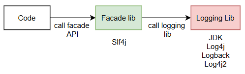

# Logger

## Logging libraries 
java jdk: java.util.logging 
- with three method: info, server, fine

log4j: org.apache.log4j.Logger
- with three method: info, error, debug
- appenders: ConsoleAppender, FileAppender, RollingFileAppender(Daily), JDBCAppender, SMTPAppender, SocketAppender...
- need to change code if switch from jdk to log4j

logback: ch.qos.logback.classic.Logger
- support slf4j

log4j2:
-support slf4j
- lazy logging, async logging mechanism

## Facade Libraries: 
- provide standard api interface to use, and can switch to different logger implementation without changing code
- apache commons: org.apache.commons.logging.Log
- slf4j: org.slf4j.Logger

## Why don't just use logger library (with a custom wrapper class) directly?
- consider you develop a jar and will be included in other application, if your logger lib is different from the application, it'll end up with two logger system logging separately.
- if your jar use slf4j, you don't need to bring logging lib yourself, let the application that includes your jar to choose which logger lib to use. 

## Recommended logging strategy
- use slf4j as facade
- choose either logback or log4j2 as logger library implementation
- don't use log4j, it's old and not develop anymore
- [logback](https://logback.qos.ch/) : Logback is intended as a successor to the popular log4j project, picking up where log4j leaves off.
- [log4j2](https://logging.apache.org/log4j/2.x/) : Log4j 2 is a new and improved version of the classic Log4j framework. It is faster, more reliable, and more flexible than Log4j 1.x.

### references
- [Logback vs SLF4J vs Log4J2 - what is the difference? Java Brains Brain Bytes
](https://youtu.be/SWHYrCXIL38?si=F7BnCVNU6JSlx0Qm)
- [Mask Sensitive Data in Logs With Logback](https://www.baeldung.com/logback-mask-sensitive-data)

